# Case Study in the Use of DBMS_CLOUD (and Other Core Database Features) to Automate Loading Data into Autonomous Database (ADB)

Derrick Cameron
July, 2021

## **Introduction** 

This documents a case study from work with a customer who had the following requirements (not strictly limited to dbms_cloud features):
- Automated load that processes data from daily and weekly csv files in Object Storage.
- Deletes the files once they are loaded (or optionally move to a new 'processed' bucket).
- Log load processes.
- Audit updates to data with information about what was changed and when.
- Provide a dashboard that shows various daily, weekly and quarterly metrics current and prior measures, with logic that handles missing data points.

There are various ways to do this, and the availability of cloud services such as events (detection of file uploads to object storage) and functions (process to load the data), use of these services is often the preferred approach (see an example of this [here](https://github.com/oracle/oracle-functions-samples/tree/master/samples/oci-load-file-into-adw-python)).  This is certainly the case where processes are orchestrated and may involve other cloud services, however it does add some complexity, other dependent platforms and services, and the need to master python or java.

This documents an alternative approach that only requires the use of SQL (which is needed in any case) and no other platform.  It is scalable and can process millions of records in seconds even using a minimal 1-ocpu ADB shape, and also offers the full power of the SQL language to handle the processing of object storage files as though they were native database files.  To illustrate we'll use data from the sh schema that is available in every Oracle Database so others can replicate these steps in their own environment.  We'll copy the *sales* table from the *sh* schema to a new *demo* schema so we can update it, but will leave the other sh tables as is and will be querying them.

## **STEP 1:** Create an Auth Token so ADB Can read files in Object Storage:

- Navigate to your users

  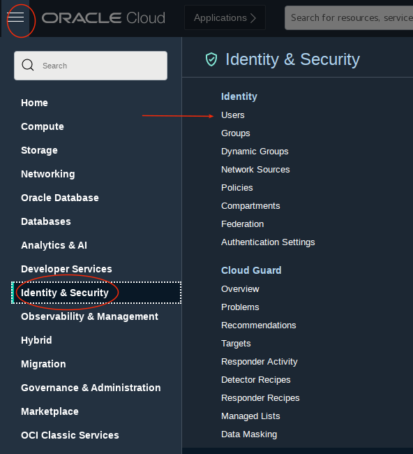

- Select the your cloud user and then select *Auth Tokens* on the left and then *Generate Token*.  I called my api key *api_token*.  Be sure to copy the generated key.

  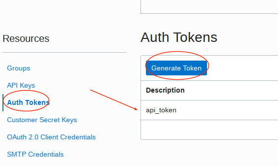

  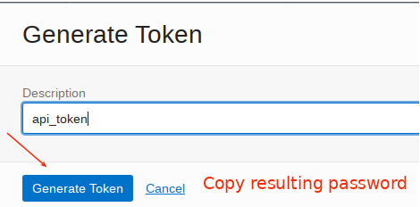

## **STEP 2:** Log into the *Admin* database user and create a database user demo with the required permissions, create a credential, and copy the sales table from sh.  You can use either SQL Developer off the cloud console or sql developer client:

- Create a new schema that will own objects (userid demo in this case) and grant the necessary privileges:
```
<copy>
create user demo identified by <password>;
grant dwrole, oml_developer, create table, create view to demo;
grant read, write on directory data_pump_dir to demo;
grant execute on dbms_cloud to demo;
alter user demo quota unlimited on data;
</copy>
```

- Log into the demo user and create a new credential.  Note if you are using a federated user you will need the federated identity in addition to the userid itself (eg: oracleidentitycloudservice/dgcameron).  If you called your api key something else the modify accordingly.
```
<copy>
BEGIN
  DBMS_CLOUD.CREATE_CREDENTIAL(
    credential_name => 'api_token',
    username => '<cloud userid>', 
    password => '<generated auth token password>'
  );
END;
/
</copy>
```

- Copy the sales table from sh to userid demo.
```
<copy>
create table sales as select * from sh.sales;
</copy>
```

## **STEP 3:** Create a new object storage bucket, upload new_sales.csv to object storage, and create an external table on that file.

- Create a new bucket called *daily_input_files*.

  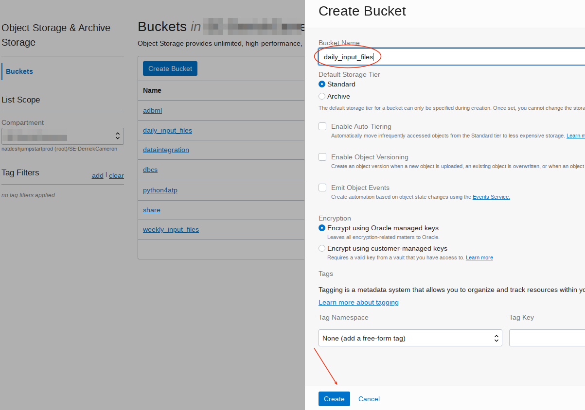

- Upload file *new_sales.csv* to this new bucket.  The file is in the *data* directory of this git repository.

  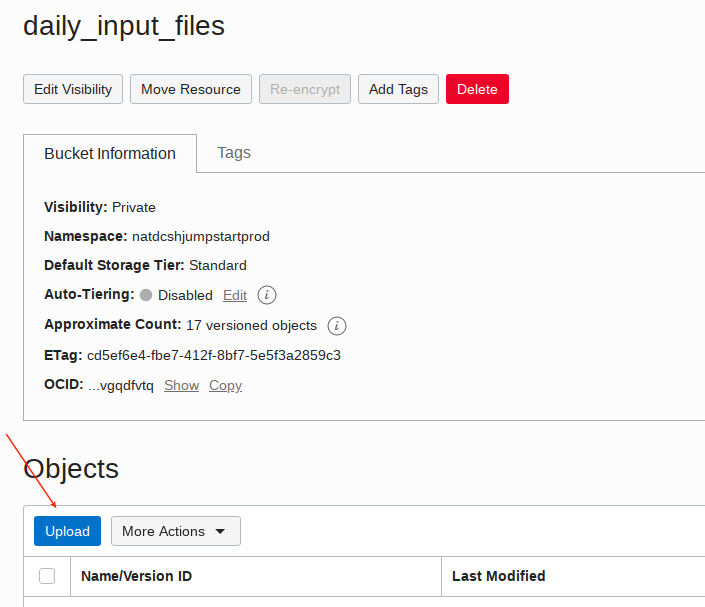

  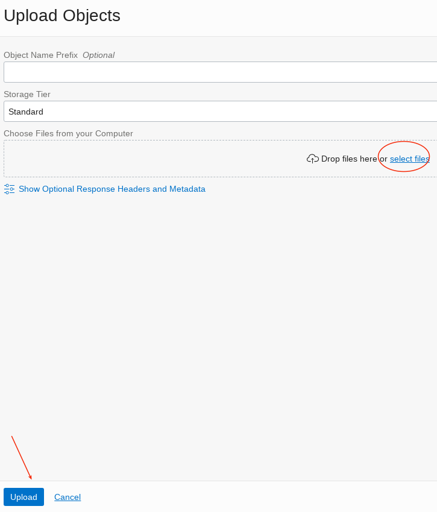

- Copy the file URL from the uploaded file by clicking on the far left dots.  *Important - note that you will in later sections be copying either the file file path URL replacing tag <object storage file URI> OR just the path up to the *.../o/* replacing tag <object storage bucket URI> into code blocks so keep these two handy in a note pad.

  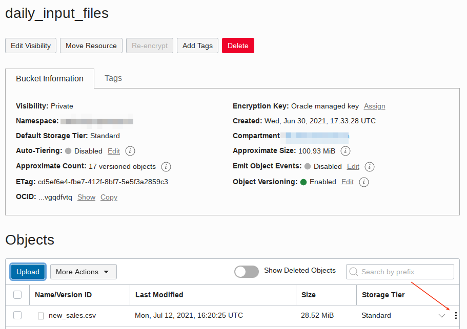

  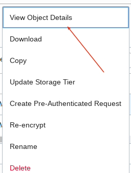

  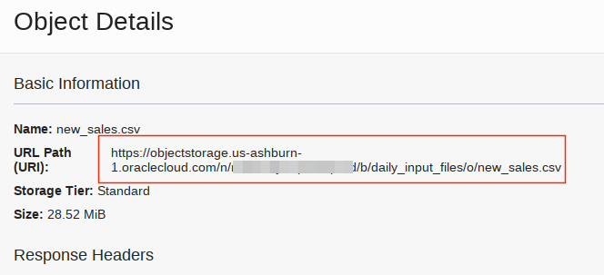


- Confirm the credential can read files in object storage.  Enter the following:
```
<copy>
SELECT * FROM DBMS_CLOUD.LIST_OBJECTS('API_TOKEN', '<object storage bucket uri>')
</copy>
```
- You should see the file you uploaded.  You can now see that you can query an object storage bucket just like any other database table.

  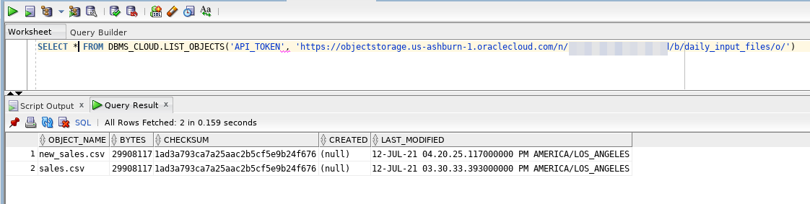

- Create a new external table that reads data from this file.  Substitute the full file uri path in this case.
```
<copy>
BEGIN
 DBMS_CLOUD.CREATE_EXTERNAL_TABLE(
 table_name =>'new_sales_ext',
 credential_name =>'api_token',
 file_uri_list =>'<object storage file URI>',
 format => json_object('delimiter' value ',', 'removequotes' value 'true','ignoremissingcolumns' value 'true','blankasnull' value 'true','skipheaders' value '1'),
 column_list => 'prod_id number, cust_id number, time_id date, channel_id number, promo_id number, quantity_sold number, amount_sold number, last_update_date date');
END;
</copy>
```

- Click on the *new\_sales\_ext* table and view data to confirm the table was created properly.  *Note: the file in object storage does NOT need to exist to create the external table.  It just needs to exist when you query the table.*

  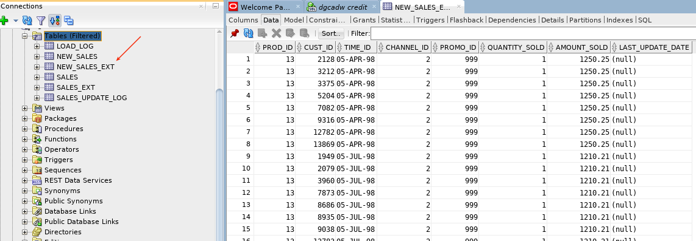

## **STEP 4:** Create other tables used in this case study.  Run the following in the demo schema.

- Run this in sqldevelper.
```
<copy>
create table sales_update_log (
prod_id number
, cust_id number
, time_id date
, channel_id number
, promo_id number
, old_quantity_sold number
, new_quantity_sold number
, old_amount_sold number
, new_amount_sold number
, update_date date);

create table load_log (
load_type varchar2(100),
file_processed varchar2(1000),
rows_processed number,
load_date date);
</copy>
```

## **STEP 5:** Create database triggers to log changes to the sales table.  The first trigger captures before and after images of the data in an audit table.  The second trigger captures change date/time stamp.  This is so you don't need to do this in your application logic.  The updates are done regardless what way you update the table (as it should be!).

- Compile this in your schema.
```
<copy>
CREATE OR REPLACE TRIGGER sales_trg
AFTER UPDATE OF quantity_sold, amount_sold ON sales
FOR EACH ROW

BEGIN

INSERT INTO sales_update_log
   ( prod_id,
     cust_id,
     time_id,
     channel_id,
     promo_id,
     old_quantity_sold,
     new_quantity_sold,
     old_amount_sold,
     new_amount_sold,
     update_date)
   VALUES
   ( :new.prod_id,
     :new.cust_id,
     :new.time_id,
     :new.channel_id,
     :new.promo_id,
     :old.quantity_sold,
     :new.quantity_sold,
     :old.amount_sold,
     :new.amount_sold,
     sysdate );

END;
/

CREATE OR REPLACE TRIGGER sales_trg2
BEFORE UPDATE ON sales
FOR EACH ROW

BEGIN

:new.last_update_date := sysdate;

END;
/
</copy>
```

## **STEP 6:** Create a stored procedure *load_sales*.

- This procedure loops through all the files in the *daily\_input\_files* bucket and for each file re-creates the external table and then loads (and logs) the data.  Be sure to replace the URI tags.  Note it does not matter what the file names are (the process will do all the files in the bucket) and afer processing it deletes them.  Since we have set versioning on the bucket the deletions can be recovered including prior versions of files with the same name.  Also note that if you wish to move the files after processing to a different bucket see a code block at the end of this document that shows how to do this.
```
<copy>
create or replace procedure load_sales as

v_row_count number;

begin

---------------------------------------------------
-- loop through files in saily_input_files bucket
---------------------------------------------------

for i in (SELECT object_name FROM DBMS_CLOUD.LIST_OBJECTS('API_TOKEN', '<object storage bucket URI>'))
loop

-- drop external table
begin
execute immediate 'drop table new_sales_ext';
exception when others then null;
end;

-- re-create external table
begin
 DBMS_CLOUD.CREATE_EXTERNAL_TABLE(
 table_name =>'new_sales_ext',
 credential_name =>'api_token',
 file_uri_list =>'<object storage bucket uri>'||i.object_name,
 format => json_object('delimiter' value ',', 'removequotes' value 'true','ignoremissingcolumns' value 'true','blankasnull' value 'true','skipheaders' value '1'),
 column_list => 'prod_id number, cust_id number, time_id date, channel_id number, promo_id number, quantity_sold number, amount_sold number');
exception when others then null;
end;

select count(*) into v_row_count from new_sales_ext;

---------------------------------------------------
-- for each file load daily data
---------------------------------------------------

insert into sales select a.* from new_sales_ext a;
commit;

-- delete existing external table
begin
DBMS_CLOUD.DELETE_OBJECT('API_TOKEN', '<object storage bucket uri>'||i.object_name);
exception when others then null;
end;

insert into load_log values('Load', i.object_name, v_row_count, sysdate);
commit;

end loop; -- end i1 loop

end load_sales;
</copy>
```

## **STEP 7:** Create a stored procedure *update_sales*.

- This procedure also loops through all the files in the daily_input_files bucket and for each file re-creates the external table and then *updates* (and logs) the data.  Note this code has used bulk load pl/sql processing to reduce pl/sql - to sql context switching, providing batch processing versus row by row processing.
```
<copy>
create or replace procedure update_sales as

v_row_count number;
type sales_t is table of new_sales_ext%rowtype index by pls_integer;
l_sales sales_t;

begin

---------------------------------------------------
-- loop through files in saily_input_files bucket
---------------------------------------------------

for i in (SELECT object_name FROM DBMS_CLOUD.LIST_OBJECTS('API_TOKEN', '<object storage bucket uri>'))
loop

-- drop external table
begin
execute immediate 'drop table new_sales_ext';
exception when others then null;
end;

-- re-create external table
begin
 DBMS_CLOUD.CREATE_EXTERNAL_TABLE(
 table_name =>'new_sales_ext',
 credential_name =>'api_token',
 file_uri_list =>'<object storage bucket uri>'||i.object_name,
 format => json_object('delimiter' value ',', 'removequotes' value 'true','ignoremissingcolumns' value 'true','blankasnull' value 'true','skipheaders' value '1'),
 column_list => 'prod_id number, cust_id number, time_id date, channel_id number, promo_id number, quantity_sold number, amount_sold number');
exception when others then null;
end;

select count(*) into v_row_count from new_sales_ext;

---------------------------------------------------
-- for each file update daily data
---------------------------------------------------

select * bulk collect into l_sales from new_sales_ext;

forall i2 in 1 .. l_sales.last

update sales
set quantity_sold = l_sales(i2).quantity_sold
    , amount_sold = l_sales(i2).amount_sold
    , last_update_date = sysdate
where prod_id = l_sales(i2).prod_id
and cust_id = l_sales(i2).cust_id
and time_id = l_sales(i2).time_id
and channel_id = l_sales(i2).channel_id
and promo_id = l_sales(i2).promo_id;
commit;

-- delete existing external table
begin
DBMS_CLOUD.DELETE_OBJECT('API_TOKEN', '<object storage bucket uri>'||i.object_name);
exception when others then null;
end;

insert into load_log values('Update', i.object_name, v_row_count, sysdate);
commit;

end loop; -- end i1 loop

end update_sales;
</copy>
```

## **STEP 8:** Create a scheduled job that will periodcally check

- Create a schedule.  *Note this sample code sets up a job that will execute every five minutes.  This is only to test.  You need to change this to suit your desired schedule.*  This is just a sample.  You would need a separate one (or combine in a package) for the update job.
```
<copy>
BEGIN
    DBMS_SCHEDULER.CREATE_JOB (
            job_name => 'LOAD_SALES_JOB',
            job_type => 'STORED_PROCEDURE',
            job_action => 'DEMO.LOAD_SALES',
            number_of_arguments => 0,
            start_date => '24-JUN-21 03.00.00 AM America/New_York',
	    repeat_interval => 'FREQ=MINUTELY;INTERVAL=5;',
            end_date => NULL,
            enabled => TRUE,
            auto_drop => FALSE,
            comments => '');

    DBMS_SCHEDULER.SET_ATTRIBUTE( 
             name => 'LOAD_SALES_JOB', 
             attribute => 'logging_level', value => DBMS_SCHEDULER.LOGGING_OFF);

-- enable
DBMS_SCHEDULER.enable(
             name => 'LOAD_SALES_JOB');
END;
</copy>
```

- Note [the following](https://stackoverflow.com/questions/26602572/oracle-dbms-scheduler-repeat-interval) can be used to confirm the proper setup of your schedule.

## How to move files between buckets (eg: archive to a different folder rather than delete the files).  Note you will need the object storage bucket uri and object storage file uri to replace in the code blocks below.
```
<copy>
-----------------------------------------------------------
-- move files from one bucket to another using dbms_cloud
-----------------------------------------------------------

-- list objects in daily_input_files bucket (source bucket)
SELECT object_name FROM DBMS_CLOUD.LIST_OBJECTS('API_TOKEN', '<object storage bucket URI>')

-- copy object to data_pump_dir oracle directory
exec dbms_cloud.get_object('API_TOKEN','<object storage file URI>','data_pump_dir');

-- review files in data_pump_dir
SELECT * FROM DBMS_CLOUD.LIST_FILES('DATA_PUMP_DIR');

-- copy file from data_pump_dir to a different bucket (target bucket - different URI).
exec DBMS_CLOUD.PUT_OBJECT ('API_TOKEN','<object storage file URI>','data_pump_dir','new_sales.csv');

-- list objects in new target bucket
SELECT object_name FROM DBMS_CLOUD.LIST_OBJECTS('API_TOKEN', '<object storage bucket URI>')

-- delete file in data_pump_dir
exec DBMS_CLOUD.DELETE_FILE ('data_pump_dir','new_sales.csv');

-- confirm file was deleted
SELECT * FROM DBMS_CLOUD.LIST_FILES('DATA_PUMP_DIR');
</copy>
```

## Analytics on external tables

- Since external tables are just like normal tables to SQL, you can take advantage of the vast high performance analytic functions in the oracle data whithout necessarily needing to load the data.  The query reads from the 940K row external table, joins it with all the other SH tables, and performs analytic functions simliar to the requirements in the customer case study.
```
<copy>
select n.channel_desc
, c.cust_first_name||' '||c.cust_last_name customer_name
, p.prod_name
, o.promo_name
, t.time_id date_sold
, s.quantity_sold
, s.amount_sold
, sum(s.amount_sold) over (partition by n.channel_desc, c.cust_first_name||' '||c.cust_last_name, p.prod_name, o.promo_name order by t.time_id) daily_sum_amount_sold
, avg(s.amount_sold) over (partition by n.channel_desc, c.cust_first_name||' '||c.cust_last_name, p.prod_name, o.promo_name order by t.time_id) daily_avg_amount_sold
from sh.channels n
, sh.customers c
, sh.products p
, sh.promotions o
, sh.times t
, sales_ext s
where n.channel_id = s.channel_id
and c.cust_id = s.cust_id
and p.prod_id = s.prod_id
and o.promo_id = s.promo_id
and t.time_id = s.time_id
</copy>
```